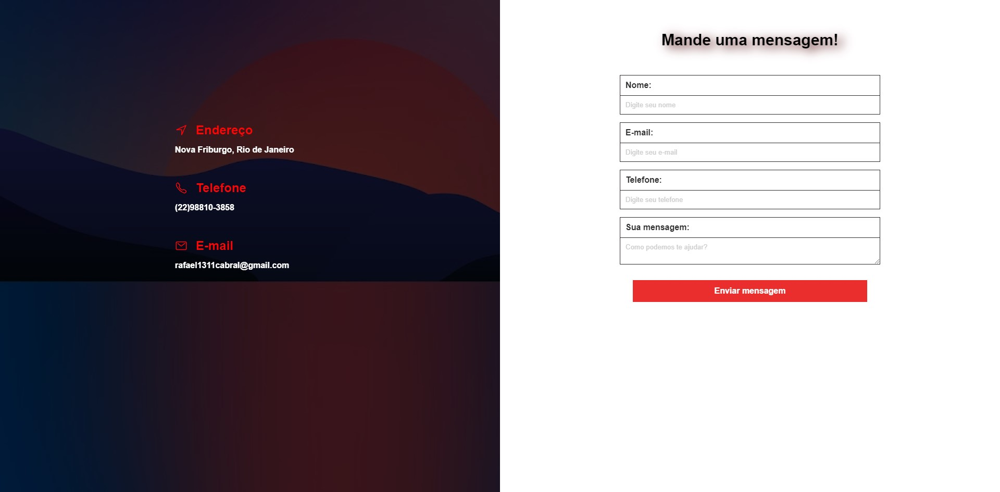

<h1 align="center">
<p><b>Página de Contato 📱<b></p>


<br>
</h1>


<a href="https://site-contacct.netlify.app/" style="text-decoration: none; color: red;">
<h2 style="text-align: center; margin: 0;">✈️ Para explorar o site, clique aqui!</h2>
</a>


## 📚 Sobre

Este é um site de **contato** responsivo, projetado para permitir que os visitantes entrem em contato com a pessoa ou empresa por trás dele.

## 🔨 Ferramentas

- [HTML5](https://www.w3schools.com/html/)
- [CSS3](https://www.w3schools.com/css/)

## ♻️ Como contribuir para este projeto

```bash
# Clone o projeto
$ git clone https://github.com/rafaelbcabral/contact-site.git
````
<br>

````bash
# Entrar no diretório
$ cd contact-site
````
<br>

````bash
# Instalar as dependencias, caso use npm
$ npm install
````

<p style="text-align: center; font-size: 15px; "><b>OR</b></p>

````bash
# Caso use Yarn
$ yarn
````

<h1></h1>
